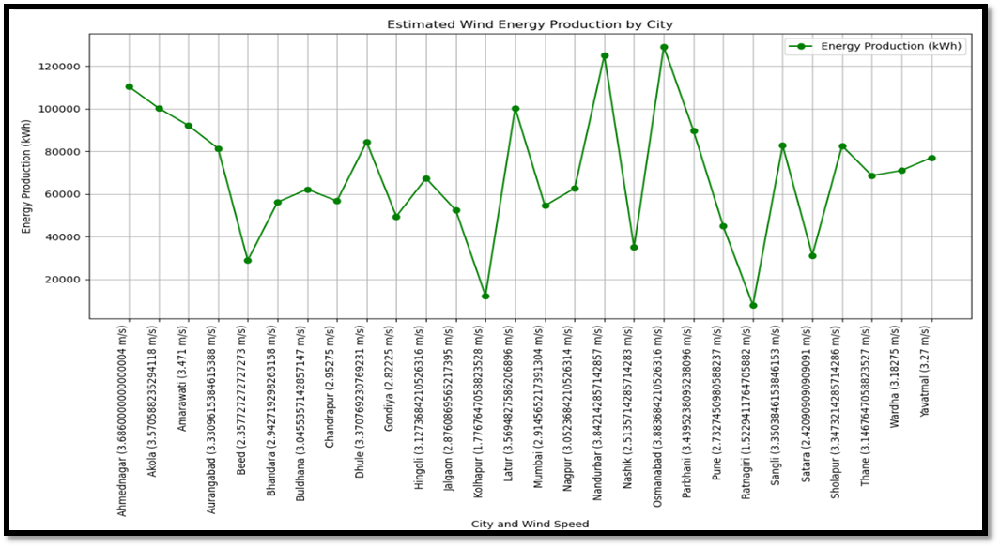
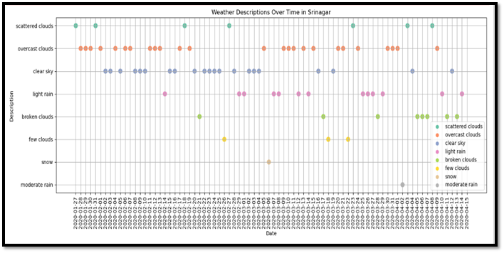
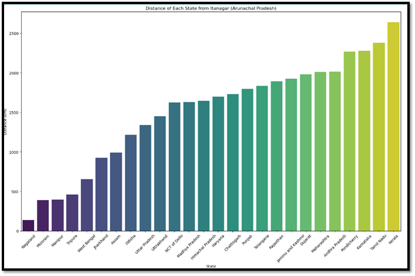
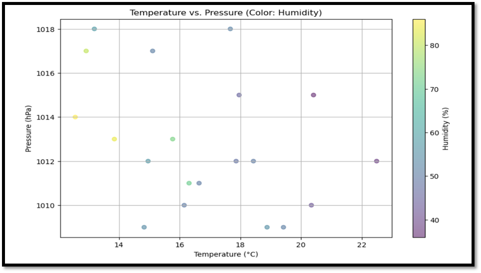
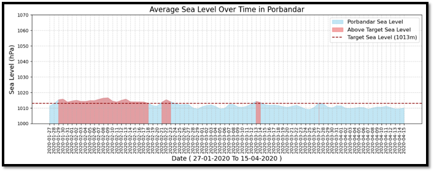

This project analyzes 2020 weather data from 365 Indian cities. Using Python, it visualizes trends and applies K-Means clustering to find temperature patterns. The goal is to derive insights for renewable energy planning, agriculture, and urban development

